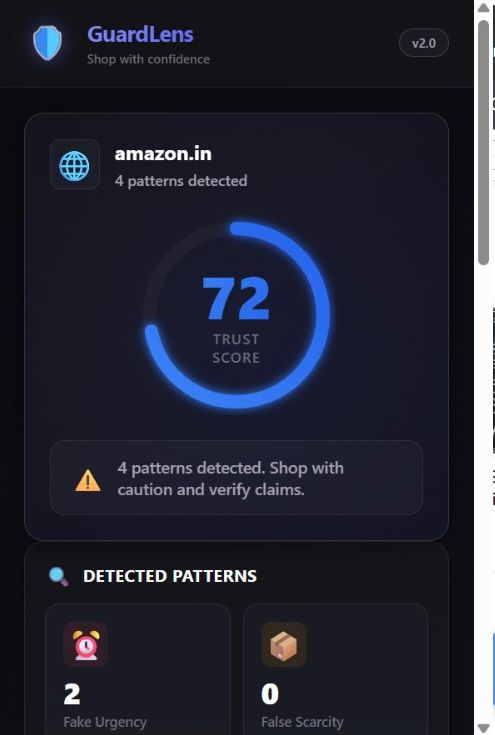
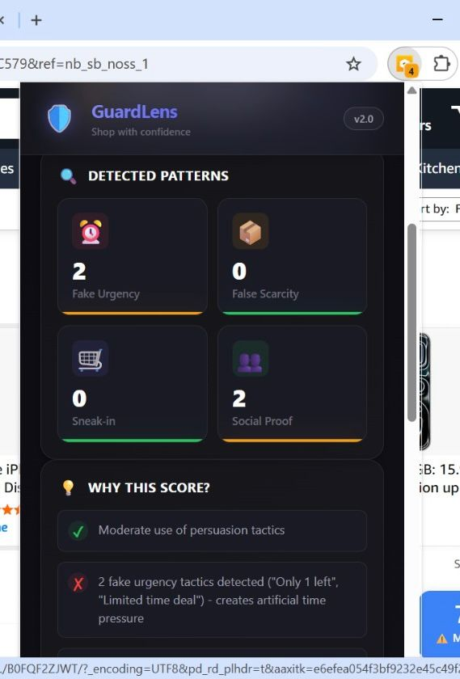
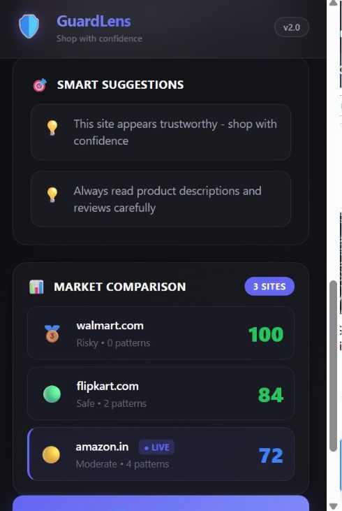
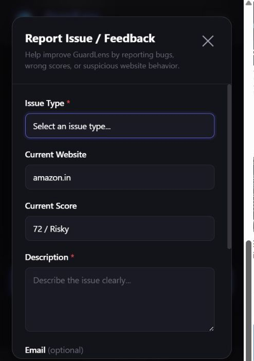

# 🛡️ GuardLens v2

> AI-powered Chrome Extension that detects dark patterns in e-commerce websites and provides a real-time trust score for safer online shopping.


---

## ✨ Overview

GuardLens helps users shop smarter by analyzing shopping websites and identifying manipulative UI tactics known as **dark patterns**.

It scans websites in real-time, calculates a trust score, highlights suspicious behavior, and compares marketplaces so users can make better decisions before purchasing.

---

## 🚀 Features

### 🔍 Trust Score Engine
- Calculates website trust score from **0 to 100**
- Instant risk level detection (**Safe / Moderate / Risky**)

### ⚠️ Dark Pattern Detection

Detects manipulative tactics such as:

- Fake Urgency  
  *(Only 1 left!, Limited time deal)

      
⚠️ Fake Urgency

      
Creates artificial time pressure to rush your decision

      
"Only 1 left"

    

      
⚠️ Fake Urgency

      
Creates artificial time pressure to rush your decision

      
"Only 1 left"

    *

- False Scarcity

- Sneak Into Basket

- Social Proof Manipulation  
  *(50 people viewing now)

      
⚠️ Social Proof Manipulation

      
Uses crowd behavior claims that may be exaggerated or fake

      
"50 people viewing"

    *

### 📊 Smart Insights
- Explains why a website received its score
- Shows detected warning signals clearly

### 🛒 Market Comparison
- Compare trust scores across popular e-commerce platforms

### 💬 Feedback System
- Users can report suspicious websites or scoring issues

### 🔄 Real-Time Re-Scan
- Refreshes and rechecks active website instantly

---

## 📸 Screenshots

### Dashboard


### Pattern Detection


### Market Comparison


### Feedback System


---

## 🛠️ Tech Stack

- JavaScript  
- HTML5  
- CSS3  
- Chrome Extension API  
- DOM Analysis Logic

---

## ⚙️ How It Works

1. User opens a shopping website  
2. GuardLens scans visible content  
3. Detects urgency / scarcity / trust signals  
4. Generates trust score instantly  
5. Shows report in popup dashboard

---

## 📦 Installation

1. Download or clone repository

```bash
git clone https://github.com/yourusername/GuardLens_v2.git
